# What a hosted Coworld episode spends its time on

A research report on the coworld-profiler measurements and the platform's own lifecycle spans, for James and the Softmax platform team. 2026-09-09. Researched against coworld-profiler `e8f4862` and metta `7e3666966c`.

## Executive summary

A hosted Coworld episode is measured from two sides. From the outside, the worker that runs the episode records five coarse phases and Kubernetes records the game pod's dispatch, and those become spans in Datadog (`packages/coworld/src/coworld/runner/phase_timings.py:18-31`; `docs/specs/0080-coworld-round-tracing-schema.md` §6). From the inside, nothing was measured at all: no timing existed between the game pod and the player pods, and the per-turn spans that spec 0080 defines exist only for the in-process arena backend. This report adds the inside view. We built a Coworld whose only purpose is to measure, ran it as 100 ordinary hosted episodes across five rounds and nine configurations, read the numbers back from the artifacts the platform already collects, and joined them to the Datadog spans of the same 96 jobs.

The headline answer to the original question: **a websocket round trip between the game pod and a player pod costs about 1 ms**. The measure is the transport residual, the round trip as the game sees it minus everything the player itself did between receipt and reply. Its median was 1.09 ms across 244 slot-episodes of the plain echo player (one slot-episode is one player slot's data from one episode), 99 percent of turns came in under 2.19 ms, and about half of it is the bare wire-and-framing floor a protocol ping shows (0.53 ms). At a 20 ms tick that is 5 percent of the budget. Transport is flat from 1 KiB to 256 KiB observations, then jumps to about 220 ms at 2 MiB where message reassembly dominates, and JSON encode and decode are a separate cost that already takes 10 ms of a 20 ms tick at 256 KiB. The second finding is about startup: each player slot appears 4 to 25 s after the game starts to listen, and only 0.3 s of that is the player's process, with 7 ms in DNS, TCP, and the handshake; the rest is pod scheduling and image pull that no container can see. The join with the spans shows what the outside view gets right and wrong: a baseline episode with 22 s of play costs 59 s of job time, the worker's `first_step_s` over-reports player startup by about 1.2 s of its own polling, its `game_boot_s` misses the game's boot entirely because the worker container starts after the game is already listening, and every job ends with an unnamed tail after the artifacts are written, 5.6 s at the median and up to 28 s.

## Contents

1. [Why this exists](#1-why-this-exists)
2. [How the profiler measures](#2-how-the-profiler-measures)
   1. [One turn](#one-turn)
   2. [Clocks](#clocks)
   3. [Connect](#connect)
   4. [Two game modes](#two-game-modes)
   5. [The whole episode](#the-whole-episode)
3. [The experiment](#3-the-experiment)
4. [The outside view: what the platform's spans say](#4-the-outside-view-what-the-platforms-spans-say)
5. [The inside view](#5-the-inside-view)
   1. [The cost of one turn](#51-the-cost-of-one-turn)
   2. [Observation size](#52-observation-size)
   3. [Fan-out to more players](#53-fan-out-to-more-players)
   4. [Tick rate and blocking turns](#54-tick-rate-and-blocking-turns)
   5. [Startup: where the seconds go](#55-startup-where-the-seconds-go)
   6. [Finalize](#56-finalize)
   7. [Context: CPU, garbage collection, clocks, stability](#57-context-cpu-garbage-collection-clocks-stability)
6. [Reconciling the two views](#6-reconciling-the-two-views)
7. [What this explains of the platform's spans](#7-what-this-explains-of-the-platforms-spans)
8. [What it cannot explain, and what would](#8-what-it-cannot-explain-and-what-would)
9. [Platform behaviour observed along the way](#9-platform-behaviour-observed-along-the-way)
10. [Recommendations](#10-recommendations)
- [Appendix A: reproducing the numbers](#appendix-a-reproducing-the-numbers)
- [Appendix B: field glossary](#appendix-b-field-glossary)
- [Appendix C: episode requests](#appendix-c-episode-requests)
- [Sources](#sources)

## 1. Why this exists

- The hosted worker records five phase durations per episode and nothing inside them.
- Per-turn spans and metrics exist only for the arena backend, which runs players in-process with no websocket.
- The cluster is deliberately agentless: containers emit no telemetry, so the only way to measure inside is to write measurements into artifacts.
- The game-facing contract is frozen, so the measuring game and players had to work within it unchanged.

The worker that runs a hosted episode stamps five durations from the outside: `game_boot_s` (until the game answers `/healthz`), `player_launch_s` (issuing the player pod creates), `first_step_s` (until the game's viewer socket delivers a first message and every player pod has started), `gameplay_s` (until results and replay exist), and `artifact_upload_s` (`packages/coworld/src/coworld/runner/phase_timings.py:18-31`; stamped at `packages/coworld/src/coworld/runner/kubernetes_runner.py:802-872`). These become spans by adding the durations up in order, anchored only at the running-stage start, and `first_step_s` gets no span at all (`app_backend/src/metta/app_backend/job_lifecycle_trace.py:284-345`). The worker polls health and artifacts once a second (`kubernetes_runner.py:95-96`), so every phase boundary carries up to a second of polling slop. Around those phases, the job's lifecycle trace also carries the `pending`, `dispatched`, and `running` stage spans and, for the game pod only, the `pod.create`, `node.allocate`, `image.pull`, and `container.start` spans read from the Kubernetes API (`job_lifecycle_trace.py:420-432, 595-627`).

Spec 0080 froze a richer vocabulary for the inside of an episode: `player.connect`, `player.turn`, `game.step`, and the metrics `player.turn.duration` and `game.step.duration`. The arena backend emits them live because it runs the game and players in one process (`app_backend/src/metta/app_backend/arena_runner/pump.py:149-158`). For the Kubernetes path there is no source, and the plan to have games write a timing file was withdrawn on 2026-08-17 because it extended the public game contract (`docs/specs/0080-coworld-round-tracing-schema.md` §3, §7). The dashboards say so explicitly (`devops/datadog/dashboards.py:6356-6362`), and the one per-step panel that exists divides the running-stage duration by episode length, a derived average rather than a measurement (`devops/datadog/dashboards.py:1691-1707`).

The constraint that shaped the design is in spec 0080 §3: nothing in the tournament cluster holds telemetry credentials, and data crosses the boundary only as artifacts. So the profiler is a normal Coworld. Its game is a normal game container, its players are normal player containers, and everything it learns leaves the cluster in `results.json`, the replay bytes, each player's artifact zip, and container logs, all of which the platform already collects.

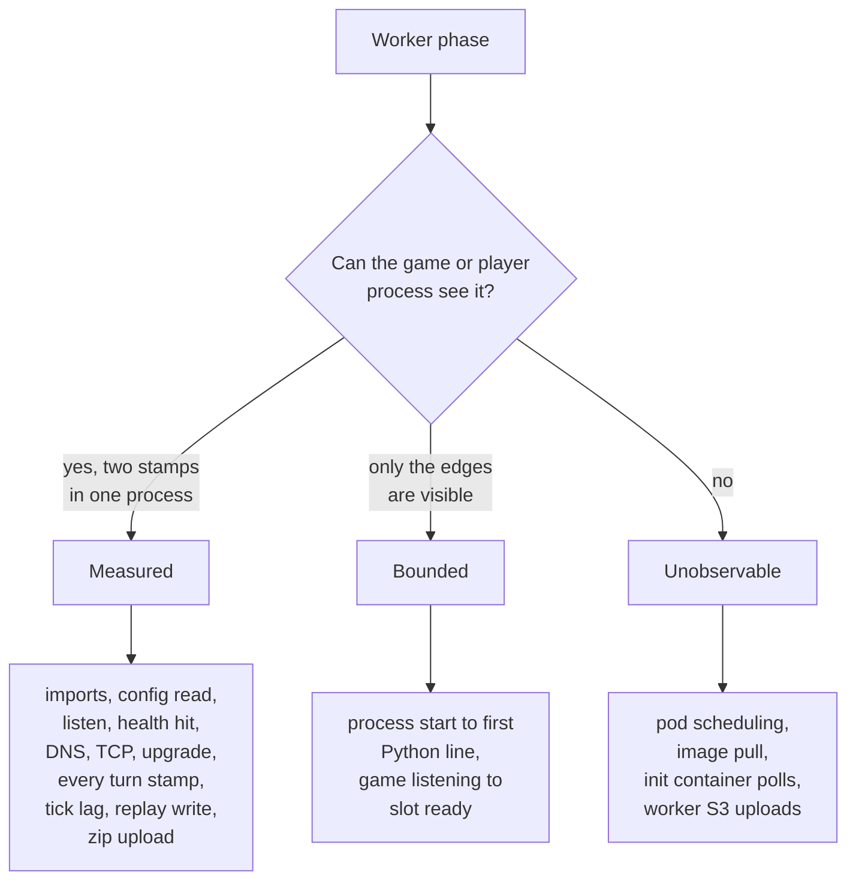

Figure 1 — How each interval was classified before building anything. "Measured" needs two timestamps in one process. "Bounded" has visible edges but hidden internals. "Unobservable" is outside every process we control; for those, the platform's own spans are the only source, and section 4 uses them.

## 2. How the profiler measures

- Every turn is stamped at eleven points, five in the game and six in the player, and the player's stamps travel back in its next message.
- The round trip minus the player's own processing is the transport residual: everything the game and player did not do themselves.
- Clocks are never compared across pods except through NTP-style probes that also report their own uncertainty.
- The game can run as a fixed-tick clock (like Crewrift, CTF, and the MettaGrid worlds) or as blocking turns (like the cogweb games).

### One turn

- Five stamps in the game, six in the player, around every observation and its reply.
- The player's stamps for turn N travel in the reply to turn N+1, because a message cannot know its own send time.
- Missing reports become nulls and negative residuals are flagged; neither happened in 406 slot-episodes.

The game stamps four moments around each observation it sends: g0 when it starts encoding the JSON, g1 when it calls send, g2 when send returns, and g3 when the reply arrives, plus g4 when the reply is decoded (`profiler/game/episode.py`, `_sender` and `handle_message`). The player stamps six: p0 when the message is received, p1 after decoding, p2 around its think step, p3 around encoding the reply, p4 when it calls send, and p5 when send returns (`profiler/player/player.py`, `_answer`).

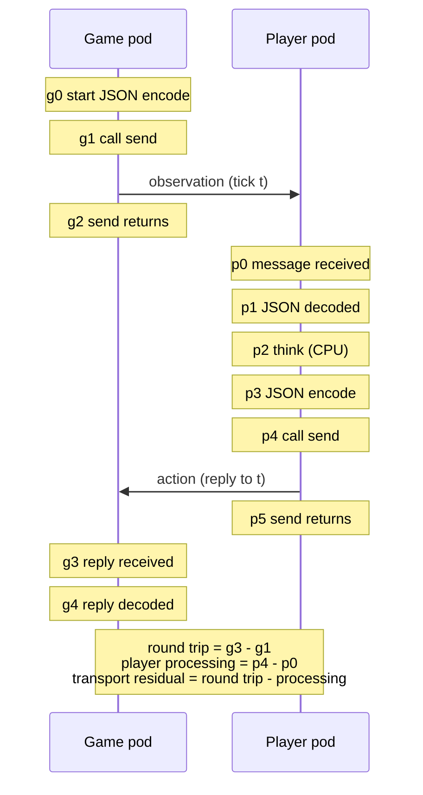

Figure 2 — The eleven stamps on one turn and the three derived quantities. The residual is what is left after subtracting everything the player did between receiving and sending. It contains socket buffers, websocket framing, library work, scheduling delay, and the wire itself, and the report never calls it "network time" on its own.

A reply cannot carry its own send timestamp, because p4 and p5 are not known until the reply has been sent. So the record for observation N rides in the action that answers N+1, and a final flush message collects the rest before the game finalizes (`profiler/protocol.py`, `TurnTiming`; `player.py`, `_answer` and `_flush`). Any turn whose player record never arrives gets a null decomposition rather than an assumed zero, and any residual that comes out negative is counted and flagged rather than clamped (`profiler/game/results.py`, `timing_report_missing_count`, `negative_residual_count`). Across 406 slot-episodes there were zero of either.

### Clocks

- Durations only ever use the monotonic clock of the process that took them.
- Wall clocks are related across pods through eight NTP-style probes per slot per window, each reporting its own uncertainty bound.

All durations use the monotonic clock of the process that took them, and a game stamp is never subtracted from a player stamp (`profiler/clocks.py`, module docstring). To relate the two pods' wall clocks, the game sends eight probes per slot before and after the measured loop. Each probe is the standard four-timestamp exchange from the NTP (Network Time Protocol) specification: T1 when the game sends, T2 when the player receives, T3 when the player replies, T4 when the game receives. The idea is that the two pods exchange timestamps in both directions; if the delay were the same each way, the difference between the two directions would give the clock offset exactly, and the gap between the two one-way bounds says how wrong that assumption could be. The offset estimate is ((T2 - T1) + (T3 - T4)) / 2 and the bounds without assuming symmetric delay are [T3 - T4, T2 - T1] (`profiler/clocks.py`, `ClockProbeSample`, `estimate_offset`). The minimum-delay probe is the representative and the bound width is reported alongside.

### Connect

- DNS, TCP connect, and the websocket upgrade are timed as three separate steps.
- Players keep `ping_timeout=None` as the platform requires; both ends allow 4 MiB messages with compression off.

The player resolves the game's Service name (the Kubernetes Service is the stable in-cluster address that fronts the game pod) with `getaddrinfo`, connects a plain TCP socket, and hands that socket to the websocket library, so DNS, TCP, and the HTTP upgrade are timed separately (`profiler/player/connection.py`, `connect_instrumented`). Every player keeps `ping_timeout=None`, which the platform requires because some deployed games do not answer pings (`packages/coworld/tests/test_coworld_player_keepalive.py:1-9`). Both ends allow 4 MiB messages and disable compression.

### Two game modes

- Fixed tick: the game never waits; a late action becomes a noop and is counted.
- Blocking: the game waits per slot, up to a 2 s deadline, the way the cogweb games do.

In fixed-tick mode the game schedules tick t at origin + t x step on its monotonic clock, sends observation t to every slot through a one-deep queue per slot, and at tick t+1 applies the action for t if it has arrived, else a noop. An action that arrives after t+1 has begun is recorded as late and never applied (`profiler/game/episode.py`, `_run_fixed_tick`, `_apply_actions`). This is what Crewrift and CTF do with their 24 fps frame limiter (`coworld-crewrift/src/crewrift/server.nim:719-728`, `sim.nim:43`) and what the MettaGrid worlds do with `step_seconds` (`packages/mettagrid/python/src/mettagrid/runner/live_episode.py:301-316, 381-388`).

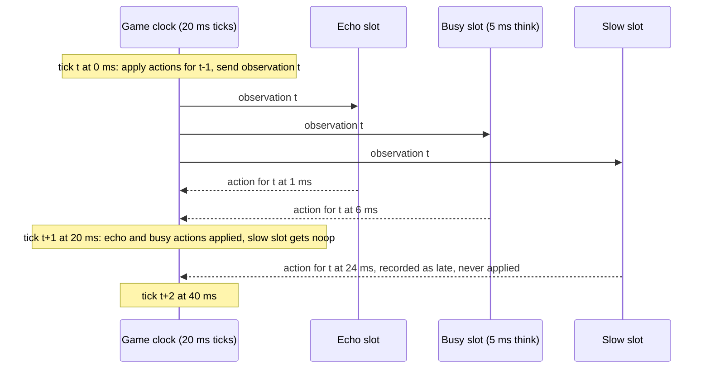

Figure 3 — Fixed-tick semantics with the measured numbers. The game never waits. A reply that misses the next tick becomes a noop for that tick and is counted as late. This is why transport time shows up in real games as stale actions, not as slower episodes.

In blocking mode the game sends one slot an observation and waits for its action or a 2 s deadline before moving to the next slot, which is the shape of the cogweb turn-based games (`packages/cogweb/packages/coworld/src/remote-pilot.ts:221-236`; `profiler/game/episode.py`, `_run_blocking`).

### The whole episode

- The game stamps its own bootstrap and the worker's first health and viewer contacts.
- Both processes sample CPU, memory, event-loop lag, and garbage collection once a second.
- Everything leaves as replay, results, player zips, and logs; the game summary is copied into every zip.

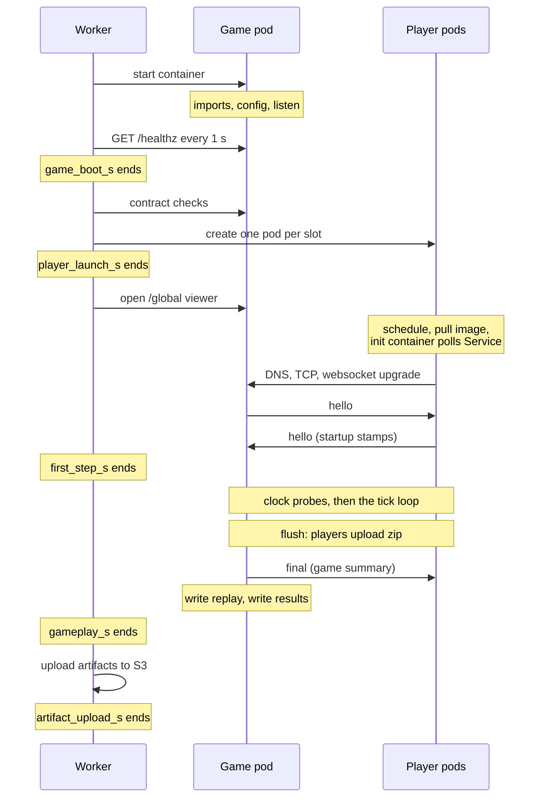

Figure 4 — Where the worker's five phases fall against what the game and players see. The game stamps its own bootstrap from the first line of Python (`profiler/__init__.py`; `profiler/game/server.py`, `GameRuntime`) and records every `/healthz` hit and the first `/global` connection, which are the worker's first observations of it. Each player's `hello` carries its startup stamps and connect attempts. The init container is a small platform-owned container that runs in the player pod before the player itself and polls the game's health until it answers.

Besides the turn stamps, both processes sample context once a second: CPU usage, throttling, quota, and memory from the container's cgroup files (the Linux accounting the kernel keeps per container), process RSS, a 10 ms event-loop lag probe, and Python garbage-collection pauses via `gc.callbacks` (`profiler/resources.py`). At the end the game writes a gzip JSONL replay containing every record, then `results.json` with aggregates only, and each player writes a zip with its raw traces plus a copy of the game's summary, so a policy owner can read the whole picture even though the raw `results.json` route is restricted to team accounts (`packages/coworld/src/coworld/docs/artifacts/RESULTS.md`; `profiler/player/player.py`, `_publish`).

## 3. The experiment

- Nine configurations, three bundled players, five rounds, 100 hosted episodes, 406 connected player slots, 76 clean episodes used for the loop results.
- Every episode's lifecycle trace was fetched from Datadog and joined to its results by job id; 96 of the 100 episodes join (the four unjoined are smoke episodes whose rows were not downloaded).
- Round 1 ran with the busy player's command line malformed, so its echo slots feed the startup tables only.
- The hosted image has two profiler-side inefficiencies that are visible in the data and outside the measured turn path.

The coworld is `profiler` 0.1.0, uploaded as `cow_f4c8de04-7d32-4bc8-a316-8cd8cda6a729` from image `coworld-profiler:coworld-8e682f09bc97` at source commit `d400b90`. Hosted smoke certification passed on upload with five smoke episodes of the certification fixture. Every experiment episode came from an experience request (`coworld xp-request`) naming one variant and a roster of two policies: `profiler-busy-5ms` in slot 0 and `profiler-echo` in the rest (`tools/request_experiments.py`). For each episode's job id the `job.lifecycle` trace was fetched from the Datadog spans API through the token broker's read-only scope (`tools/fetch_spans.py`) and joined to the profiler's results (`tools/reconcile_spans.py`).

| Variant | Slots | Tick | Observation | Measured ticks | Question |
|---|---|---|---|---|---|
| baseline-2p-20ms | 2 | 20 ms | 1 KiB | 1,000 | the baseline round trip |
| tick-2p-24fps | 2 | 41.7 ms | 1 KiB | 1,000 | the Crewrift and CTF tick |
| tick-2p-50ms | 2 | 50 ms | 1 KiB | 1,000 | the hungercog default tick |
| fanout-4p, -8p, -16p | 4, 8, 16 | 20 ms | 1 KiB | 1,000 | cost of more players |
| payload-sweep | 2 | 20 ms | 1 KiB to 2 MiB, two passes | 8 x 100 | cost of observation size |
| blocking-turns | 2 | wait per decision, 2 s deadline | 1 KiB | 1,000 | the cogweb shape |
| long-10000-ticks | 2 | 20 ms | 1 KiB | 10,000 | drift, GC, keepalive over 200 s |

Variant definitions are in `coworld_manifest_template.json` (`variants`). Every variant runs 100 warmup ticks first (10 per cell in the sweep); warmup samples are excluded from all statistics.

The bundled players share one image and one code path. `echo` decodes, replies noop, encodes, and sends. `busy` does the same plus a deterministic arithmetic loop that burns 5 ms of thread CPU per turn, measured with `thread_time_ns` so throttling would show as longer wall time for the same CPU (`profiler/player/player.py`, `burn_cpu`). `slow-start` sleeps 5 s before connecting and only appears in the certification fixture.

Rounds and caveats:

- Round 1 (19 experiment episodes plus 5 smoke episodes) ran with the busy policy's command line stored as one token, `--think-cpu-ms 5`, because the upload loop did not split the argument. The player exited with an argparse error, the game waited its full 180 s connect timeout, then ran with slot 0 empty. The echo slots measured normally, so round 1 contributes to the startup tables but not to the loop tables. Section 9 records what the platform did with those episodes.
- Rounds 2 to 5 (76 episodes) are clean: 12 baseline, 8 of every other variant.
- In the hosted image the 2 MiB payload takes about 21 s to generate, because the generator re-encodes on every added row. This inflates `game_boot_s` for the eight sweep episodes only and is outside every turn measurement. The repository's generator builds it in 0.25 s (`profiler/payload.py`).
- In the hosted image the player-side event-loop-lag summary is null, because the samples are moved into the record store before being summarized. The raw samples are in the zips (`profiler/player/player.py`).

## 4. The outside view: what the platform's spans say

- A baseline episode with 22 s of measured play is a 59 s job: 1.7 s pending, 13.7 s dispatched, 7.2 s of player startup, 23.3 s of gameplay as the worker sees it, 0.5 s of finalize, and 7.8 s of tail after the artifacts are written.
- The dispatched stage, before the worker even starts, is the largest fixed cost, and only about 4.7 s of it is accounted for by the game pod's own create and container-start spans.
- `game_boot_s` reads 0.1 s in every non-sweep episode; it is not measuring the game's boot.
- `image.pull` spans exist for 21 consecutive jobs only, four per pod (one per container), and 78 of those 84 spans have a zero duration; `node.allocate` is 0 on all 96.

The lifecycle trace of every job carries the three stage spans, the four runtime phase spans derived from the worker's timings, and the game pod's dispatch spans. `first_step_s` has no span, but the phase spans are laid end to end, so it is the gap between `player.launch` ending and `episode.loop` starting. The tail is the gap between `episode.finalize` ending and the `running` stage ending.

| Span or derived interval | Median | p90 | Min | Max | n |
|---|---|---|---|---|---|
| stage pending | 1,216 | 2,956 | 106 | 3,973 | 96 |
| stage dispatched (pod create to worker start) | 14,284 | 42,108 | 7,041 | 44,985 | 96 |
| `pod.create` (game pod) | 3,717 | 10,467 | 0 | 13,467 | 96 |
| `node.allocate` (game pod) | 0 | 0 | 0 | 0 | 96 |
| `image.pull` (game pod, when emitted) | 0 | 0 | 0 | 0 | 21 |
| `container.start` (game pod) | 1,000 | 2,000 | 0 | 4,000 | 96 |
| stage running | 55,143 | 224,404 | 19,236 | 394,540 | 96 |
| `game.bootstrap` (`game_boot_s`) | 104 | 17,504 | 87 | 21,602 | 96 |
| `player.launch` (`player_launch_s`) | 151 | 1,015 | 131 | 1,076 | 96 |
| `first_step_s`, derived | 7,175 | 26,364 | 4,456 | 34,083 | 96 |
| `episode.loop` (`gameplay_s`) | 25,365 | 204,896 | 0 | 378,173 | 96 |
| `episode.finalize` (`artifact_upload_s`) | 557 | 1,576 | 410 | 1,978 | 96 |
| running stage after `episode.finalize` ends | 5,553 | 11,626 | -830 | 28,266 | 96 |
| whole job | 82,612 | 246,102 | 31,623 | 404,689 | 96 |

All 96 joined episodes, milliseconds; p90 is the 90th percentile, the value that nine in ten episodes stay under. The p90 of `game.bootstrap` is the eight sweep episodes' 21 s payload build (section 3). The p90 of `first_step_s` comes from eight episodes in which the worker placed the boundary between player startup and gameplay about 10 s late; section 6 explains them. The negative minimum of the tail is one job whose `running` stage ended before its finalize span did, which can happen because the phase spans are placed by adding durations end to end from the stage start rather than from their own timestamps.

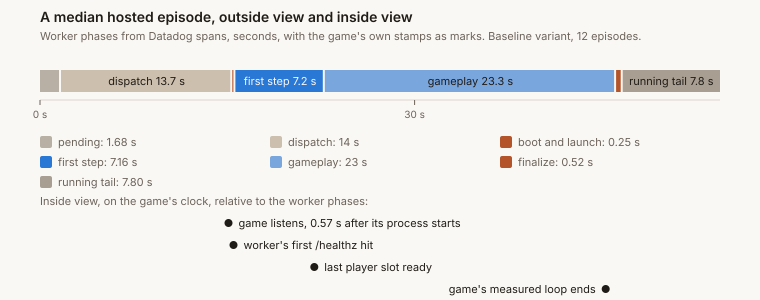

Figure 5 — A median baseline episode laid out in job time from the worker's spans, whole job 59 s. The game's own stamps are placed on the same axis below the bar, aligned through the worker's first `/healthz` hit, which both sides see. Gameplay is 23 of 59 seconds. The game was already listening before the worker's `game_boot_s` phase began.

Three things in this table are not what the phase names suggest. First, `game_boot_s` is 87 to 126 ms in every episode that is not a sweep, while the game's own stamps say it takes 0.55 s from process start to listening. The worker container in the same pod starts after the game container, and by the time its first `/healthz` poll goes out the game has been listening for about 0.4 s; the 104 ms is the worker's own Kubernetes client initialization plus one successful request. The game's real boot is inside the `dispatched` stage. Second, the `dispatched` stage is 13.7 s at the baseline median and up to 45 s, and the game pod's `pod.create` (3.7 s) and `container.start` (1 s, at one-second resolution) explain about 4.7 s of it; `image.pull` spans exist only for 21 consecutive jobs between 17:36 and 17:48 UTC, four per pod for the `game`, `worker`, `bedrock-sidecar`, and `coworld-init-config` containers, and 78 of those 84 have a zero duration: the pod watcher stored the kubelet `Pulled` event but not the `Pulling` event, and the fallback that reads the pull time out of the `Pulled` message did not match, so the span start collapses onto its end (`app_backend/src/metta/app_backend/job_lifecycle_trace.py:613-619`; `job_runner/k8s_event_store.py:53-83`). The gap from pod creation to the pod's `Initialized` condition, which is where the four image pulls and the init container run, is 7 s at the median and 29 s at worst, and it is the largest unaccounted piece of the stage. Third, the `running` stage continues for 5.6 s at the median and up to 28 s after `episode.finalize` ends. That is the worker's log collection, child pod deletion, and the platform's observation of the job's termination, none of which has a span.

## 5. The inside view

- All numbers are milliseconds unless stated.
- "p50" is the median and "p99" the 99th percentile, the value that 99 in 100 turns stay under; both are read off the sorted samples of the measured phase only.
- A slot-episode is one player slot's data from one episode; per-variant rows are medians across the episodes of that variant.
- The tables were produced by `tools/aggregate_rounds.py` and are reproduced in full in the working directory's `data.md`.

### 5.1 The cost of one turn

- Transport residual for a 1 KiB observation and its reply: 1.09 ms median, 2.19 ms p99, across 244 echo slot-episodes.
- The residual is close with a 5 ms busy player (0.75 ms median against 1.09 for echo), so the decomposition separates the player's own work from transport; the difference has a mundane cause explained below.
- A raw protocol ping/pong takes 0.53 ms, so about half the residual is the floor of the wire plus framing.
- Late actions at a 20 ms tick: 0.59 percent pooled for echo slots and 2.9 percent for busy, but one disturbed episode holds most of both; without it, echo is 0.24 percent (745 of 306,000) and busy about 0.6 percent (787 of 130,000).

| Policy | Slot-episodes | Round trip p50 | Round trip p99 | Player processing p50 | Think CPU p50 | Residual p50 | Residual p99 | Game send await p50 | Ping p50 | Late actions |
|---|---|---|---|---|---|---|---|---|---|---|
| echo | 244 | 1.17 | 2.29 | 0.09 | 0 | 1.09 | 2.19 | 0.02 | 0.53 | 1,858 of 316,000 (0.59 %) |
| busy | 68 | 5.88 | 6.59 | 5.12 | 5.02 | 0.75 | 1.40 | 0.03 | 0.50 | 4,004 of 140,000 (2.86 %) |

Pooled over the clean fixed-tick and blocking episodes at 1 KiB. Zero negative residuals and zero missing timing reports in both populations.

The busy player's processing is 5.12 ms for 5.02 ms of CPU: the think loop runs uninterrupted, which is consistent with the absence of any CPU quota on player pods (section 5.7). Its residual is slightly lower than echo's, which is expected: the game's own event loop is idle while the busy player thinks, so the reply is picked up with less scheduling delay.

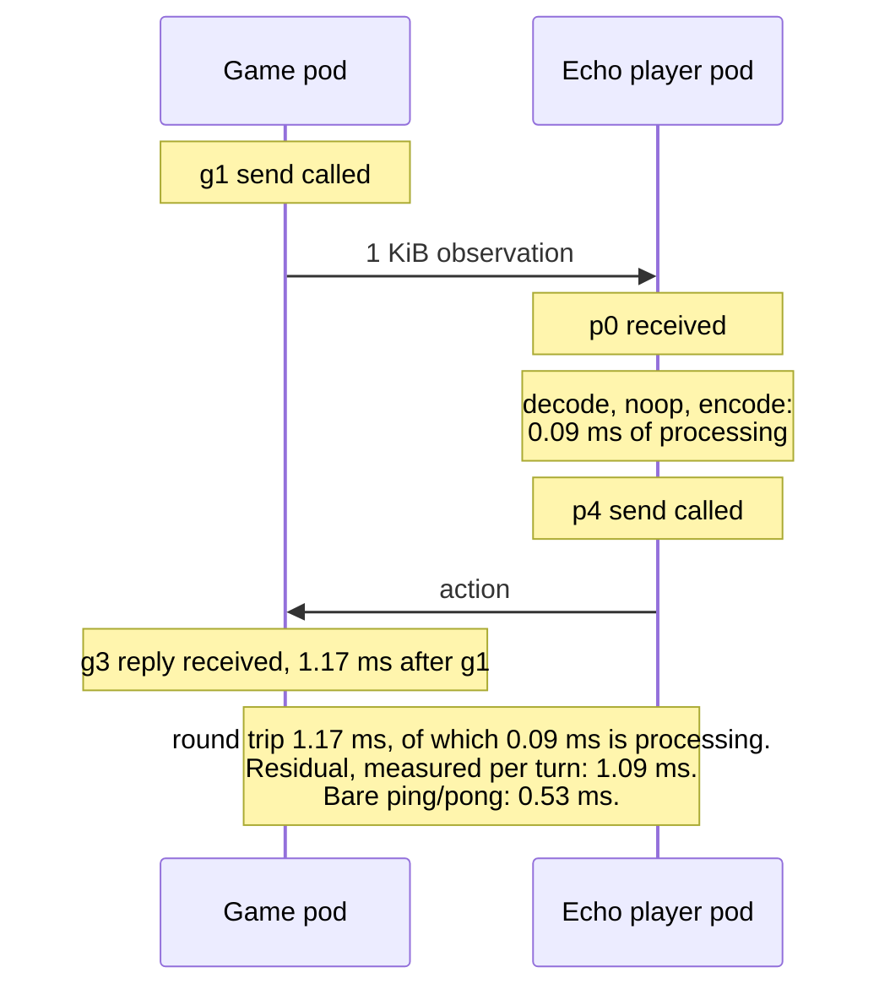

Figure 6 — Figure 2 again with the measured medians for an echo slot at 1 KiB. The player's own work is 0.09 ms of the 1.17 ms round trip and the transport residual is 1.09 ms; each is the median of its own per-turn distribution, so they do not subtract exactly. The 0.53 ms ping shows the floor.

The busy late rate needs a caveat. Of its 4,004 late actions, 3,217 come from one 10,000-tick episode (`ereq_2c9d462c`) in which both slots saw residual p99 of 75 to 79 ms and maximum round trips near 200 ms for a stretch; the echo slot in that episode was late 1,113 times too. That is a disturbance in something both pods share, consistent with a node- or network-level event, and not a busy-player effect; the profiler cannot confirm node placement (section 8). Across the 12 clean baseline episodes the busy slot was late 0 to 4 times out of 1,000, and at the 41.7 ms and 50 ms ticks it was never late in 16,000 observations.

The residual is also stable across slot-episodes: across 244 echo slots its median ranged from 0.42 to 1.96 ms, with the middle 80 percent between 0.60 and 1.64 ms. The round trip's p99 across those same slots has a longer tail (median 2.29 ms, 90th percentile of slot p99s 10.1 ms, worst 75.3 ms), and every slot p99 above 15 ms belongs to either the disturbed long episode or a 16-slot episode.

The game's `send` call returned in 0.02 ms at the median and never blocked long even at 16 slots, so the game process is never waiting on a socket. Whatever the residual contains happens after the bytes leave the game's event loop.

### 5.2 Observation size

- Round trip is flat to within 1 ms from 1 KiB to 16 KiB, about 10 ms at 256 KiB, and about 260 ms at 2 MiB.
- Below 256 KiB the growth is JSON encoding in the game and decoding in the player, not the residual.
- At 2 MiB the residual itself jumps to 220 ms: the player's websocket library must reassemble the whole message before delivering it.
- A Python game cannot hold a 20 ms tick at 2 MiB; the loop fell 10 s behind and 64 percent of actions were late.

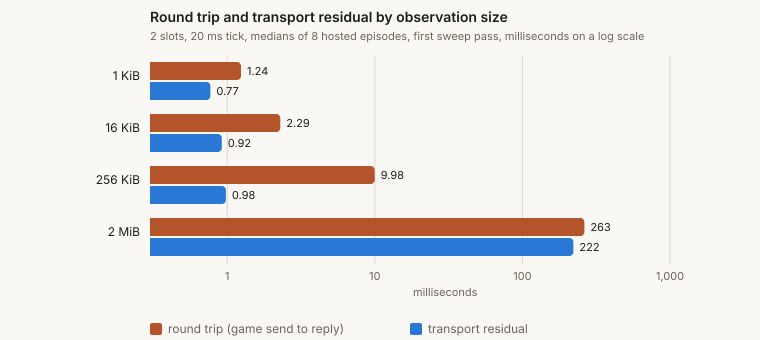

Figure 7 — Round trip and transport residual by observation size, first pass of the sweep, medians of 8 episodes, on a logarithmic axis because the values span three orders of magnitude; every bar carries its value. The residual stays under 1 ms up to 256 KiB while the round trip grows tenfold, so the gap is JSON work on both ends. At 2 MiB the residual becomes most of the round trip.

| Cell | Bytes | Round trip p50 | Round trip p99 | Residual p50 | Residual p99 | Game encode p50 | Samples |
|---|---|---|---|---|---|---|---|
| 1 KiB, first pass | 992 | 1.24 | 6.14 | 0.77 | 1.14 | 0.04 | 1,600 |
| 16 KiB | 16,370 | 2.29 | 6.77 | 0.92 | 1.41 | 0.29 | 1,600 |
| 256 KiB | 262,122 | 9.98 | 24.72 | 0.98 | 15.03 | 3.81 | 1,600 |
| 2 MiB | 2,097,152 | 263.10 | 334.32 | 221.73 | 290.92 | 32.04 | 1,600 |
| 2 MiB, second pass | 2,097,128 | 263.32 | 331.59 | 219.54 | 284.07 | 33.13 | 1,600 |
| 256 KiB, second pass | 262,142 | 61.55 | 158.09 | 53.98 | 148.74 | 3.74 | 1,600 |
| 16 KiB, second pass | 16,356 | 4.94 | 566.26 | 4.67 | 560.98 | 0.22 | 1,600 |
| 1 KiB, second pass | 998 | 3.01 | 1,084.56 | 2.95 | 1,079.49 | 0.02 | 1,600 |

Medians over the 8 clean sweep episodes. The p99 of 6 ms in the small cells is the busy slot's 5 ms think plus transport, not a tail.

The second pass runs the sizes in reverse order and shows the aftermath of the 2 MiB cells. The game's event loop fell about 10 s behind during them (tick lag p99 of 10.6 s), and the fixed-tick loop catches up by running overdue ticks back to back with no sleep between them. The 256 KiB, 16 KiB, and 1 KiB cells that follow therefore inherit a backlog of stale 2 MiB frames in the socket buffers and a game that is sending as fast as it can. Their p99 round trips read 158 ms, 566 ms, and over 1 s, getting worse as the messages get smaller, because the catch-up ticks fire faster for small observations and each one adds to the queue while the player is still working through the large frames ahead of it. That is a profiler-induced artifact of how the sweep is sequenced, but it is also exactly what a real game would experience if it ever shipped a burst of oversized frames at a short tick.

The reading for real games: CTF's sprite frames are multi-megabyte (`docs/specs/0076-arena-single-pod-experiment.md:117, 573`). At that size the per-turn cost is dominated by serialization and message reassembly. The 263 ms round trip measured here is more than six Crewrift ticks of 41.7 ms, though that is an extrapolation from a Python game and Python players, not a measurement of CTF itself. Crewrift and CTF are Nim, not Python, so their encode cost is lower, but the reassembly cost on the player side is a property of the payload size and the player's websocket library, not of the game's language.

### 5.3 Fan-out to more players

- The residual rises gently with slot count: 0.69 ms at 2 slots, 0.72 at 4, 0.91 at 8, 1.38 at 16.
- Within a 16-slot episode the slowest echo slot's median is about 1.7 times the fastest's, with no fixed ordering.
- The cost of fan-out lands in the game's event loop and garbage collector, not in the sockets.

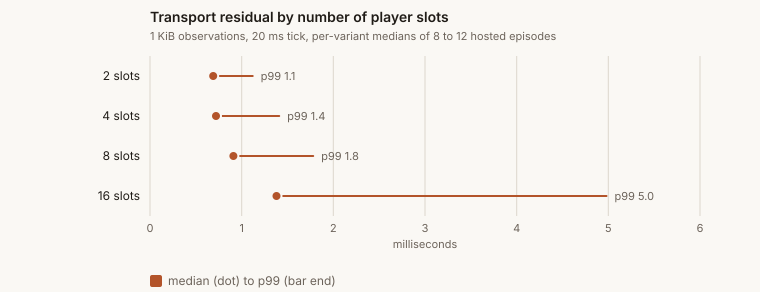

Figure 8 — Transport residual by slot count: the dot is the per-variant median and the bar reaches to the p99. The median moves by 0.7 ms from 2 to 16 slots; the p99 is where the extra slots show, and it is still under 5 ms.

| Slots | Episodes | Residual p50 | Residual p99 | Game tick lag p99 | Game loop lag p99 | GC max pause | Late |
|---|---|---|---|---|---|---|---|
| 2 | 12 | 0.69 | 1.12 | 1.20 | 1.06 | 15.6 | 0.05 % |
| 4 | 8 | 0.72 | 1.41 | 0.93 | 1.05 | 15.5 | 0.04 % |
| 8 | 8 | 0.91 | 1.78 | 0.81 | 1.47 | 16.6 | 0.00 % |
| 16 | 8 | 1.38 | 4.98 | 1.40 | 4.67 | 54.6 | 0.37 % |

Per-variant medians, 1 KiB, 20 ms tick.

| Slots | Fastest echo slot, round trip p50 | Median echo slot, round trip p50 | Slowest echo slot, round trip p50 | Game send await p99, worst slot |
|---|---|---|---|---|
| 2 | 0.78 | 0.78 | 0.78 | 0.41 |
| 4 | 0.66 | 0.78 | 0.84 | 0.20 |
| 8 | 0.74 | 1.03 | 1.24 | 0.08 |
| 16 | 1.06 | 1.54 | 1.82 | 0.08 |

Spread of per-slot round-trip medians within an episode, median across episodes. The game rotates the send order every tick, and no slot is consistently first or last.

The table carries two lag columns. Tick lag is how late a scheduled tick actually started; loop lag is how late a 10 ms periodic sleep woke up, which measures how busy the game's event loop is between ticks. At 16 slots the loop lag p99 rises from 1 to 4.7 ms and the worst garbage-collection pause from 16 to 55 ms, while tick lag barely moves and `send` calls still return in well under 0.1 ms. The game is doing 16 encodes and 16 decodes per tick in one Python event loop, and that, plus the collector working through the profiler's own record buffers, is what the extra slots cost. The transport itself grows by about 0.7 ms from 2 to 16 slots.

### 5.4 Tick rate and blocking turns

- The 41.7 ms (24 fps) and 50 ms ticks behave like 20 ms at 1 KiB, with zero late actions in 16,000 busy observations.
- Blocking turns cost 0.59 ms per echo decision and 5.67 ms per busy decision; 2,000 decisions took 7.4 s of loop time.

| Variant | Episodes | Residual p50 | Residual p99 | Late |
|---|---|---|---|---|
| tick-2p-24fps | 8 | 0.73 | 1.28 | 0 % |
| tick-2p-50ms | 8 | 0.78 | 4.13 | 0 % |
| blocking-turns | 8 | 0.51 | 1.06 | 0 timeouts |

For the blocking shape, the per-decision turn time as the game sees it was 0.59 ms for echo and 5.67 ms for busy at the median, with a pooled p99 of 6.18 ms. Transport adds about half a millisecond to every decision, which is invisible next to the seconds an LLM-backed player spends thinking, and the 2 s deadline was never hit.

### 5.5 Startup: where the seconds go

- The game is ready to serve about 0.55 s after its process starts, and the worker notices within its 1 s poll.
- Each player slot appears 4 to 25 s after the game starts listening.
- The player's own process accounts for about 0.3 s of that, and DNS plus TCP plus the websocket upgrade for 7 ms.
- Everything else, about 5 to 6 s at the median and up to 24 s per slot, is pod scheduling, image pull, and the init container's Service poll, none of it visible from inside.

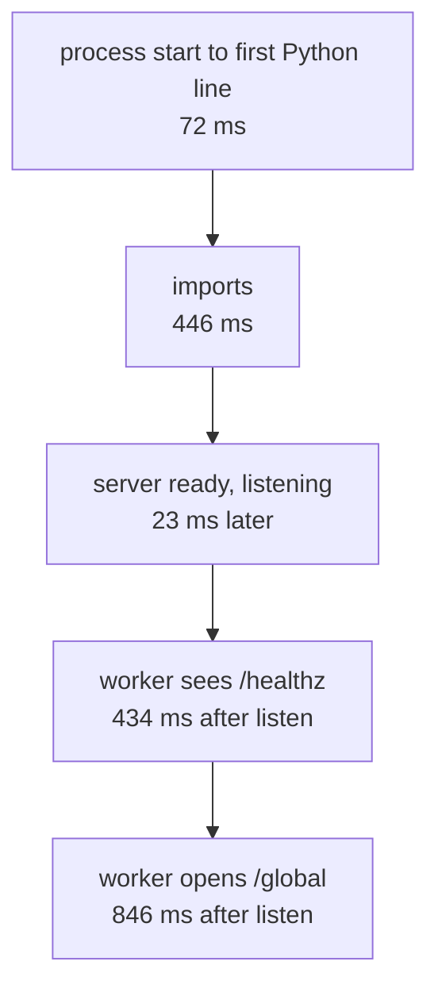

Figure 9 — The game pod's median startup, top to bottom in time. Every step is measured from inside the game. The game is listening about 0.55 s after its process starts; the two worker steps show when the worker first noticed it.

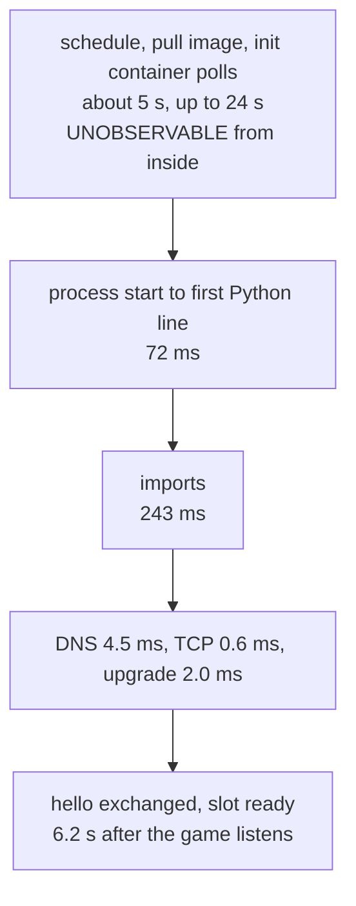

Figure 10 — One player slot's median startup, counted from the moment the game starts listening. The first box is the part no container can measure, and it is most of the timeline; the three measured player steps together are about 0.3 s.

| Interval | Median | p90 | Min | Max | n |
|---|---|---|---|---|---|
| game: process start to first Python line | 72 | 108 | 45 | 241 | 100 |
| game: imports (FastAPI, uvicorn, websockets, pydantic) | 446 | 572 | 314 | 942 | 100 |
| game: config read | 0.09 | 0.65 | 0.08 | 3.2 | 100 |
| game: server start | 23 | 36 | 16 | 75 | 100 |
| game listening to first `/healthz` hit | 434 | 660 | 45 | 1,212 | 100 |
| game listening to first `/global` viewer | 846 | 1,584 | 268 | 2,702 | 100 |
| game listening to first slot ready | 5,314 | 7,966 | 3,768 | 15,191 | 100 |
| game listening to last slot ready | 6,691 | 15,642 | 4,412 | 24,956 | 100 |
| player: process start to first Python line | 72 | 93 | 38 | 265 | 394 |
| player: imports | 243 | 301 | 168 | 887 | 394 |
| player: DNS resolve of the Service | 4.5 | 5.2 | 3.1 | 19.3 | 406 |
| player: TCP connect | 0.57 | 0.82 | 0.24 | 3.2 | 406 |
| player: websocket upgrade | 2.0 | 2.7 | 1.3 | 10.2 | 406 |
| player: game listening to this slot ready | 6,174 | 13,264 | 3,768 | 24,956 | 406 |

All 100 hosted episodes; the game-listening intervals are on the game's clock. The two rows with n = 394 come from replays, and the replays of four smoke episodes (12 slots) were not downloaded; the rows with n = 406 come from results.json, which every episode has.

The `/healthz` number is the worker's first look at the game and it lands at 434 ms median, which is what a 1 s poll against a server that became ready at a random point in the poll interval produces. The `/global` viewer opens about 0.4 s after that, following the worker's contract checks and pod creates. From there to the first player hello is about 4.5 s at the median (5.3 s from listening to the first slot ready, minus the 0.85 s to the viewer). Figure 10 quotes 6.2 s because it is the median over all 406 slots rather than the first slot of each episode; later slots in an episode are ready later, and the 16-slot episodes stretch the tail. The DNS lookup, TCP connect, and websocket upgrade together take 7 ms, and they are a warm path, because the platform's init container has already been polling the same Service for the game's health before the player process was allowed to start (`packages/coworld/src/coworld/runner/kubernetes_runner.py:135-150, 1131-1150`).

So the span-less `first_step_s` phase decomposes as: under 1 s of worker checks and viewer connect, 0.3 s of player process startup per slot, 7 ms of network setup per slot, and 4 to 24 s per slot of Kubernetes work that only the Kubernetes API can account for. The 16-slot episodes had the widest spread, with last-slot-ready up to 25 s.

### 5.6 Finalize

- Building the replay takes 190 ms at the median and 1.3 s for the 10,000-tick episodes; writing it to the shared workdir is under 1 ms.
- Each player's zip upload through the worker's artifact server takes 125 ms at the median, 1.4 s at worst.
- The worker's own S3 uploads afterwards are outside every process here; the spans put `artifact_upload_s` at 0.56 s median.

| Interval | Median | p90 | Max | n |
|---|---|---|---|---|
| game: replay build (gzip of all records) | 188 | 1,085 | 1,754 | 100 |
| game: replay write to workdir | 0.36 | 0.67 | 6.7 | 100 |
| player: artifact zip PUT | 125 | 193 | 1,437 | 406 |

Hosted games receive `file://` targets for results and replay, and the worker does the S3 upload after the game exits (`app_backend/src/metta/app_backend/job_runner/dispatcher.py:940-948`), so the `artifact_upload_s` phase is the worker's work and the game's own write is negligible. The player zip goes over HTTP to an upload server the worker runs in the game pod, which is why it costs 100 ms rather than 1 ms.

### 5.7 Context: CPU, garbage collection, clocks, stability

- No CPU quota on game or player pods; zero throttling in 100 episodes.
- Node clocks agree closely (median offset 0.07 ms), but the probes' own uncertainty of about 0.75 ms is too wide to split the round trip into one-way halves.
- The baseline residual was between 0.49 and 1.01 ms in every one of 12 episodes across four rounds.
- One 10,000-tick episode out of 8 hit a period of 75 ms residuals in both slots at once.

Both the game and every player reported a cgroup CPU period of 100 ms with no quota, and the throttled-time counter never moved. A player that sizes its thread pools from `os.cpu_count()` sees the whole node. The runner does support a per-player CPU limit, but it was not set for these episodes (`packages/coworld/src/coworld/runner/kubernetes_runner.py:1053-1058`).

Garbage collection in the game is worth separating from the platform. The worst pause was 16 ms in 2-slot episodes, 55 ms at 16 slots, and 80 ms in the 10,000-tick episodes, which had about 320 collections. A good share of that is the profiler's own record buffers growing for the replay, so treat these as an upper bound on what a Python game with a similar allocation pattern would see, not as a platform property.

The clock probes put the player pod's wall clock at 0.07 ms ahead of the game's at the median, with a range of -0.16 to +0.44 ms across 406 slots and a median bound width of 0.75 ms. That is not tight enough to split the 1 ms round trip into one-way halves, because the uncertainty is nearly as large as the thing being measured, so the report does not lean on one-way estimates.

Stability across rounds: the baseline residual per episode was 0.49, 1.01, 0.72 in round 2 and 0.56, 0.70, 0.81, 0.67, 0.59, 0.76, 0.85, 0.64, 0.67 in rounds 3 to 5. The 10,000-tick episodes (202 s of loop each) showed no drift in round trip or residual over their length, and their 0.49 percent median late rate is driven by the one disturbed episode described in 5.1; the others were at 0.02 to 0.1 percent.

## 6. Reconciling the two views

- In 68 of 76 clean episodes the worker's `first_step_s` runs about 1.1 s longer than the game's own measure of the same interval: that is the worker's polling delay in noticing that the pods started. In the 8 slowest startups the worker placed that boundary a further 10 s late and booked gameplay as player startup.
- `game_boot_s` reads 0.1 s while the game itself takes 0.55 s to boot, because the worker container starts after the game is already listening; the game's boot is hidden inside the `dispatched` stage.
- In those same 68 episodes `gameplay_s` exceeds the game's measured loop by 1.4 s at the median: the profiler's own probe, flush, and write phases plus up to a second of artifact polling.
- For a 22 s baseline loop the whole job is 59 s at the median; the play is 37 percent of it.

The join is by job id: each results file names its episode request, each episode request row names its job, and each job has exactly one lifecycle trace. Both clocks meet at one event both sides see, the worker's first successful `/healthz` request, which is the end of `game_boot_s` on the outside and the first health hit stamped inside the game.

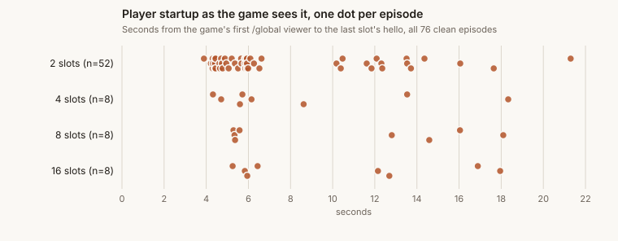

Figure 11 — Player startup as the game sees it, one dot per clean episode, grouped by slot count: the time from the game's first `/global` viewer to the last slot's hello. Three groups appear at every slot count: 50 episodes between 3.9 and 6.6 s, 18 between 8.6 and 14.6 s, and 8 between 16 and 21 s, with gaps between them. The worker's `first_step_s` for the same episodes sits about 1.1 s to the right of each dot in the first two groups and about 10 s to the right in the third.

| Interval | Outside, from spans | Inside, from the game | Difference and cause |
|---|---|---|---|
| player startup: `first_step_s` versus first viewer to last slot ready | 7,173 median (n=76) | 5,904 median | in 68 episodes the inside number is 1,138 ms shorter at the median, between 641 and 1,579 ms across the 10th to 90th percentiles: the worker polls pod status once a second and then reads its viewer socket, so it notices the last pod start about a second late; the game sees the hello directly. In 8 episodes the worker's number is 10.3 to 11.7 s longer, because its boundary landed late |
| game boot: `game_boot_s` versus process start to listening | 104 | 572, plus 401 from listening to the worker's first `/healthz` hit | the worker starts its poll after the game is up; `game_boot_s` measures the worker's client setup and one request, not the game |
| gameplay: `gameplay_s` versus the measured loop | 25,365 | 22,010 | in the 68 episodes with a correctly placed boundary the outside number is 1,373 ms longer per episode at the median (672 to 2,891 across the 10th to 90th percentiles): the profiler's clock-probe windows, drain, flush, and replay build (about 0.5 to 1 s) plus the worker's 1 s artifact poll. In the 8 late-boundary episodes `gameplay_s` is 6.7 to 9.8 s shorter than the loop, and in two of them (`ereq_bc36967e`, `ereq_f44fda14`) it is 0 |
| finalize: `artifact_upload_s` versus replay build | 564 | 178 | the worker's S3 uploads and debug archive; the game's write is under 1 ms |
| `player_launch_s` | 151 median, 1,076 max | the game sees the contract checks in under 10 ms | the rest is Kubernetes API calls, one per player pod |

Milliseconds, clean episodes unless stated. The per-episode differences are medians of differences, not differences of medians; the two medians in a row therefore do not subtract to the difference column.

Set the eight slowest episodes aside and the two views agree on player startup at every slot count: the worker says 7.1, 7.3, 6.6, and 7.3 s for 2, 4, 8, and 16 slots, the game says 5.8, 5.7, 5.5, and 6.2 s. The slot count does not move the median. What varies is which group an episode lands in. On the game side, 50 episodes took 3.9 to 6.6 s, 18 took 8.6 to 14.6 s, and 8 took 16 to 21 s, and all three groups appear at 2, 4, 8, and 16 slots. The steps between the groups are fixed costs of roughly 6 to 8 s that some episodes pay once, which is the signature of a scheduling or image-pull wait for the player pods rather than a per-pod cost. The spans cannot say which, because player pods have no dispatch spans (section 8).

The eight slowest episodes also expose a defect in the outside view. The worker ends `first_step_s` when its viewer socket delivers a first message after every player pod has started. In these eight it did so 10.3 to 11.7 s after the game had already seen every player's hello, so about 10 s of play was booked as startup, `gameplay_s` came out 6.7 to 9.8 s shorter than the game's own loop, and two of them (`ereq_bc36967e`, `ereq_f44fda14`) recorded a `gameplay_s` of 0. They occur at every slot count, and they are exactly the episodes whose pods took longest to start, so whatever delayed the pods also delayed the worker's detection of them by a further ten seconds; the trace does not say what. Any dashboard that divides `gameplay_s` by episode length inherits the error, and in one episode in ten it is a 10 s error on a 22 s quantity.

The whole-job accounting for the baseline variant, medians of 12 episodes: 1.7 s pending, 13.7 s dispatched, 0.1 s `game_boot_s`, 0.15 s `player_launch_s`, 7.2 s `first_step_s`, 23.3 s `gameplay_s` (of which 22.0 s is the measured loop), 0.5 s `artifact_upload_s`, and 7.8 s of running-stage tail. Those medians sum to 54.5 s; the median of the whole-job span itself is 59 s, and the gap is the parts of each job that no span names. Against the 59 s, play is 37 percent; pod dispatch and player startup together are 35 percent; the tail is 13 percent.

## 7. What this explains of the platform's spans

- `game.bootstrap`: does not measure the game's boot; the inside view does, at 0.55 s, and the game's boot sits inside `dispatched`.
- `first_step_s`: the player-side and network parts are measured and small; the large remainder is Kubernetes, bounded by both views, and the span over-reports it by about 1.1 s in most episodes and by 10 s in one episode out of ten.
- `episode.loop`: the per-turn decomposition that spec 0080's `player.turn` and `game.step` describe now exists for the Kubernetes path, in artifacts rather than spans.
- `episode.finalize` and the running tail: the game-side and player-side writes are measured; the worker's S3 uploads and the 5 to 8 s tail after them are not.

| Platform phase or span | Before | Now measured | Still unobservable |
|---|---|---|---|
| `dispatched` stage, `pod.create`, `container.start` | one duration plus two game-pod spans | the game's boot inside it: process start to listening 572 ms | 9 to 10 s per episode between pod create and worker start not covered by any span; `image.pull` carries no duration |
| `game.bootstrap` (`game_boot_s`) | one duration | the worker's own startup and one poll; the game's real boot is 572 ms, elsewhere | container runtime work before the process, failed health polls |
| `player.launch` (`player_launch_s`) | one duration | the game's handling of the worker's contract checks | the pod-create API calls |
| `first_step_s` (no span) | one duration | player process start (72), imports (243), DNS (4.5), TCP (0.6), upgrade (2.0), listen to slot ready (5.3 s first, 6.7 s last); about 1.1 s of the span is polling delay, and one episode in ten has the boundary 10 s late | scheduling, image pull, init-container polls: 4 to 24 s per slot |
| `episode.loop` (`gameplay_s`) | one duration | every turn: round trip 1.2 ms, processing, residual 1.1 ms, encode, send awaits, tick lag, staleness, loop lag, GC; the span exceeds the loop by 1.4 s when its boundary is right | worker's artifact polling |
| `player.connect` (arena only) | absent on k8s | per-slot DNS, TCP, upgrade, and listen-to-ready | the cold Service path |
| `player.turn`, `game.step` (arena only) | absent on k8s | full per-turn records in the replay, distributions in results | nothing on the measured path |
| `episode.finalize` (`artifact_upload_s`) | one duration | replay build and write, player zip PUT | the worker's S3 uploads |
| running tail after finalize | nothing | nothing inside; 5.6 s median, 28 s max from the spans | log collection, child deletion, termination observation |

The result field names follow the frozen vocabulary (`player_connect_*`, `player_turn_duration*`, `game_step_duration*`, `episode_loop_*`) so a trusted backend reader could emit the frozen metrics from these aggregates without inventing new names (`profiler/game/results.py`, module docstring; `docs/specs/0080-coworld-round-tracing-schema.md` §7 cardinality rules). No such reader exists; that wiring is deliberately outside this work.

## 8. What it cannot explain, and what would

- The 4 to 24 s per slot between pod create and player process start.
- The 9 to 10 s of the `dispatched` stage not covered by the game pod's own spans.
- Whether the game and a given player landed on the same node.
- The running tail after the artifacts are written, 5.6 s at the median and up to 28 s.
- Whether the initial Service path was cold.

The largest unexplained interval is the one the profiler was structurally unable to touch: pod scheduling and image pull for player pods. It is also the one the platform is best placed to explain, because the Kubernetes API already records pod creation, scheduling, image pull, and container start events, and spec 0080's B4 track emits exactly those as `pod.create`, `node.allocate`, `image.pull`, and `container.start` spans for the game pod. Its implementation note says player pods sit outside the watcher's pod selector, so those spans are game-pod-only (`docs/specs/0080-coworld-round-tracing-schema.md`, 2026-08-25 revision note). Extending the watcher to player pods would explain the remaining startup time with no change to the game contract. The same spans for the game pod need attention first: the watcher captured pull events for only 21 consecutive jobs, the spans it built from them have no duration because the `Pulling` event was never stored, and `container.start` is at one-second resolution, so the game pod's own dispatch is only partly explained even though its created-to-initialized gap of 7 s median points at the image pulls.

Node placement is the second gap. The Service path is measured, but the residual would differ for a player on the game's own node versus another node, and the profiler cannot tell which it got. Joining pod placement from the Kubernetes API to the per-slot residuals in these artifacts would answer that directly.

## 9. Platform behaviour observed along the way

- A player container that exits at startup yields a `completed` episode with a 0 score and no failure marker, and its 180 s wait is booked as `gameplay_s`.
- `coworld upload-policy` treats each `--run` value as one argv token, spaces included.
- The policy upload completion endpoint returned HTTP 500 once and succeeded on an identical retry.
- The certification fixture must run every bundled player, which is not stated in the authoring docs.
- The Datadog spans API rate-limits trace fetches at roughly two requests per second, which matters for any tool that walks one trace per job.

The first of these matters beyond this project. In round 1 the busy player exited with an argparse error before connecting. The game waited its full `player_connect_timeout_seconds` of 180 s, started with the seat empty, and finished normally. The platform recorded each of those episodes as `completed` with a score of 0 for the missing policy and no `error_type`, `failed_policy_index`, or `failed_agent_index`. Only the game's own results (`slots[0].connected == false`) and the missing policy artifact for that slot reveal what happened, and in Datadog the wait appears as 194 s of gameplay. A real league would have charged that policy nine losses and three minutes of cluster time per episode without a signal that the container never ran.

## 10. Recommendations

- Treat pod-to-pod websocket transport as a solved question at about 1 ms per turn for observations up to 256 KiB. It is not where hosted episode time goes. JSON encode and decode are a separate cost that reaches about 10 ms, half a 20 ms tick, at 256 KiB, so observation size still matters even though the wire does not.
- For games with multi-megabyte frames, measure the player-side reassembly cost, because that, not the wire, is the 200 ms.
- Rename or re-anchor `game_boot_s`. It measures the worker's startup, not the game's, and it hides the game's real boot inside the `dispatched` stage.
- Extend the pod watcher to player pods so `image.pull` and `container.start` spans cover the 4 to 24 s per slot that dominates `first_step_s`, and make the game pod's `image.pull` span carry a duration, by storing the `Pulling` event reliably or by reading the pull time from the `Pulled` message.
- Add a span for the running-stage tail after `episode.finalize`. It is 5.6 s at the median and 28 s at worst, a tenth of a baseline job, and nothing names it.
- Anchor the end of `first_step_s` on an event the worker observes directly, or record the boundary's own timestamp, so that a slow viewer read cannot move 10 s of gameplay into startup as it did in 8 of 76 episodes here.
- Surface a crashed player container as an episode failure rather than a completed episode with a zero score and 180 s of phantom gameplay.
- Decide deliberately whether player pods should have a CPU quota; today they do not.
- Keep the profiler as a standing tool: one experience request per variant reproduces every table here in about ten minutes, and `tools/fetch_spans.py` plus `tools/reconcile_spans.py` reproduce the join.

## Appendix A: reproducing the numbers

- Hosted episodes are requested per variant, downloaded per episode, and aggregated by the tools in `tools/`.
- The span join needs Datadog read access through the token broker; everything else needs only the coworld CLI login.

From the profiler checkout, with the coworld CLI from the metta checkout:

```bash
uv run --project ~/coding/metta python tools/request_experiments.py \
  --coworld cow_f4c8de04-7d32-4bc8-a316-8cd8cda6a729 \
  --echo 0f164e07-647c-4be9-86aa-8a166fc9f792 \
  --busy 7d3c651c-3a4e-475f-9260-105135309f93 \
  --episodes 2 > tmp/xreqs.tsv
uv run --project ~/coding/metta python tools/summarize_experiments.py tmp/xreqs.tsv --out tmp/hosted
uv run python tools/aggregate_rounds.py tmp/hosted:round
python3 ~/coding/metta/scripts/token_broker_client.py exec --scope datadog.read \
  --reason "reconcile profiler episodes with lifecycle spans" -- python3 tools/fetch_spans.py tmp/jobs.json tmp/spans
uv run python tools/reconcile_spans.py tmp/spans tmp/hosted
```

`tools/fetch_episode.py` downloads a single episode's results, replay, and player zips; `tools/analyze_replay.py` prints the headline numbers from any of the three. The per-turn records are in the replay (`turn` records) and in each zip's `turns.jsonl`. `tools/report_charts.py` draws the charts in this report from the aggregate numbers.

## Appendix B: field glossary

- Every quantity in the report is defined here in one line; the full field reference with formulas is `docs/measurement-reference.md`.

The full field reference is `docs/measurement-reference.md`. The terms used in this report:

| Term | Meaning |
|---|---|
| round trip | game send call to game receive of the reply (g3 - g1) |
| player processing | player receive to player send call (p4 - p0), everything the player did |
| transport residual | round trip minus player processing; socket buffers, framing, library work, scheduling, wire |
| send await | how long a `send` call blocked (g2 - g1 in the game, p5 - p4 in the player) |
| tick lag | actual tick start minus scheduled tick start on the game's clock |
| loop lag | how late a 10 ms periodic sleep woke up in a process |
| late action | an action that arrived after the next tick began and was never applied |
| slot ready | the moment the player's `hello` reached the game, on the game's clock, relative to when the game started listening |
| slot-episode | one player slot's data from one episode; 244 echo slot-episodes means 244 (slot, episode) pairs |
| bound width | the width of the interval [T3 - T4, T2 - T1] within which the clock offset must lie without assuming symmetric delay; the probe's own uncertainty |
| stage | one of the job's three lifecycle stages in Datadog: `pending` (created to claimed), `dispatched` (claimed to worker start), `running` (worker start to terminal) |
| running tail | the part of the `running` stage after the `episode.finalize` span ends |

## Appendix C: episode requests

- Every hosted episode used in the report, by experience request id, so any number can be traced to its raw artifacts.

Round 1 (busy slot absent, startup tables only): experience requests `xreq_9f13c600`, `xreq_ae3d919d`, `xreq_051ba6dc`, `xreq_4ff8c270`, `xreq_37f28745`, `xreq_b4fb3be7`, `xreq_3fea4d83`, `xreq_6258c93c`, `xreq_6bfe3480`; smoke episodes `ereq_290f7936`, `ereq_89a36168`, `ereq_8a7405b3`, `ereq_c000f207`, `ereq_c082a437`.

Round 2: `xreq_07a5d464`, `xreq_c30fdeff`, `xreq_b0db21a8`, `xreq_a7112d58`, `xreq_3f510b34`, `xreq_df59e7a2`, `xreq_a351bb00`, `xreq_de281355`, `xreq_376e28bc`.

Rounds 3 to 5: `xreq_bd442195`, `xreq_03b3209a`, `xreq_fde769b6`, `xreq_808d8244`, `xreq_405b592d`, `xreq_03c3ed2d`, `xreq_d0b3e1a2`, `xreq_a8ebb9e9`, `xreq_bac3b7f5`, `xreq_2fb8f653`, `xreq_9141152d`, `xreq_ebafa9d3`, `xreq_8f4a567d`, `xreq_43836e3d`, `xreq_cb2fd578`, `xreq_2fe4102e`, `xreq_51642434`, `xreq_ef78c797`, `xreq_dae0d640`, `xreq_7cbdab80`, `xreq_6d0ad9f3`, `xreq_373f25bf`, `xreq_5bad52b0`, `xreq_a6c33e45`, `xreq_b3851916`, `xreq_92fe2a59`, `xreq_674846b9`.

The disturbed long episode discussed in 5.1 is `ereq_2c9d462c`. Its job's lifecycle trace is `6aa19f4e0000000048dd5ba46dcf5b23`.

## Sources

- metta `packages/coworld/src/coworld/runner/phase_timings.py:18-31` — the five worker phases.
- metta `packages/coworld/src/coworld/runner/kubernetes_runner.py:95-96, 135-150, 802-872, 1053-1058, 1131-1150, 1756` — poll cadence, init container, phase stamping, CPU limit, player Service URL.
- metta `app_backend/src/metta/app_backend/job_lifecycle_trace.py:284-345, 420-432, 595-627` — phase durations to spans, `first_step_s` has no span, the game-pod dispatch spans.
- metta `app_backend/src/metta/app_backend/arena_runner/pump.py:149-158` — arena's `player.turn` and `game.step`.
- metta `app_backend/src/metta/app_backend/job_runner/dispatcher.py:940-948` — hosted games get `file://` targets.
- metta `app_backend/src/metta/app_backend/job_runner/k8s_event_store.py:53-83` — how kubelet Pulling and Pulled events are stored per pod and container.
- metta `docs/specs/0080-coworld-round-tracing-schema.md` §1, §3, §6, §7 and the 2026-08-25 revision note — coverage, agentless rule, frozen vocabulary, arena-only status, player pods outside the watcher.
- metta `docs/specs/0076-arena-single-pod-experiment.md:117, 573` — CTF frames are multi-megabyte.
- metta `devops/datadog/dashboards.py:1691-1707, 6356-6362` — derived per-step panel; arena-only note.
- metta `packages/coworld/src/coworld/docs/artifacts/RESULTS.md` — who can read `results.json`.
- metta `packages/coworld/tests/test_coworld_player_keepalive.py:1-9` — why `ping_timeout=None`.
- metta `packages/mettagrid/python/src/mettagrid/runner/live_episode.py:301-316, 381-388` — MettaGrid worlds' fixed-tick wait and stale-action noop.
- metta `packages/cogweb/packages/coworld/src/remote-pilot.ts:221-236` — cogweb blocking decisions.
- `coworld-crewrift/src/crewrift/sim.nim:43`, `server.nim:719-728` — 24 fps frame limiter.
- coworld-profiler `profiler/game/episode.py` — tick loop, stamps, late-action semantics.
- coworld-profiler `profiler/player/player.py` — player stamps, delayed reports, busy loop, artifact.
- coworld-profiler `profiler/player/connection.py` — DNS, TCP, upgrade split.
- coworld-profiler `profiler/clocks.py` — NTP-style offset math.
- coworld-profiler `profiler/resources.py` — cgroup, loop lag, GC sampling.
- coworld-profiler `profiler/game/results.py` — result fields and vocabulary.
- coworld-profiler `profiler/game/server.py` — bootstrap stamps and finalize.
- coworld-profiler `profiler/payload.py` — payload generation.
- coworld-profiler `profiler/protocol.py` — message shapes.
- coworld-profiler `coworld_manifest_template.json` — variants, players, certification fixture.
- coworld-profiler `docs/measurement-reference.md` — field-by-field meaning.
- coworld-profiler `tools/aggregate_rounds.py`, `tools/request_experiments.py`, `tools/summarize_experiments.py`, `tools/fetch_episode.py` — how the inside data was produced.
- coworld-profiler `tools/fetch_spans.py`, `tools/reconcile_spans.py`, `tools/report_charts.py` — how the spans were fetched, joined, and charted.
